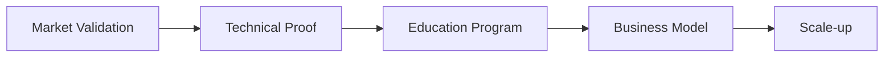

# Validation Plan
## Claudine AI Agent
Bridge-to-Market Program

---
## Key Hypotheses

### Market 🎯
* SMEs will adopt open-source AI agent to reduce specialist dependency
* Premium support model is viable
* High demand for AI agent education
* Scientific institutions would want to automate part of the research

### Technical 🔧
* Self-modifying AI agents can be much more effective
* Distributed agent works across platforms
* Semantic input improves autonomous coding feedback loop
* Framework is developer-friendly

---
## Validation Timeline
### Month 1-6: Education Track 📚

* Series of [workshops](https://xemantic.com/ai/workshops/)
* Building brand awareness among software companies to jump in with consulting services later
* Test revenue models
  * workshops at client's location
  * GitHub sponsors programme

---
## Validation Timeline (cont.)
### Months 1-6: Technical Proof 💻

<small>The AI software stack needs constant evolution:</small>

* Claudine 1 as a blueprint educational project
* Claudine 2 testing wildest ideas 
  * xemantic-openai-sdk-kotlin (other LLMs)
  * Alignment with [Model Context Protocol](https://modelcontextprotocol.io/)
  * Optimize semantic input
  * Test distributed architecture
  * Recursive and self-modifying agents

---
## Validation Timeline (cont.)

### Months 3-4: Market Research 📊
* The needs of scientific community
* Measure developer onboarding

### Months 4-6: Business Model 💡
* Service package testing
* Integration validation
* Scale-up preparation

---
## Success Metrics

### Market KPIs 📈
* Waiting list growth
* Premium conversion rate
* Workshop satisfaction
* Community engagement
* Papers written by Claudine

### Technical KPIs ⚡
* Cross-platform communication
* Cross-LLM solution
* High score on software dev bench
* Recursive agents: cost reduction thanks to task breakdown and limited token window 

---
## Expected Outcomes

By program end:
* ✅ Validated business model
* ✅ Proven technical scalability
* ✅ Educational materials adjusted
* ✅ Customer pipeline built

---
## Path to Market

