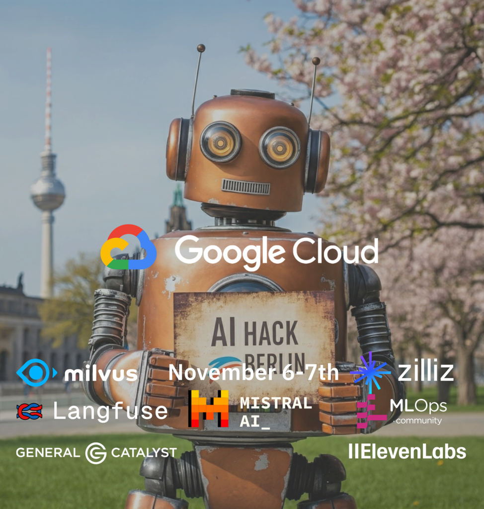

## Internet

- Prachtsaal guest
- password: cooperative

---
## Agentic AI Workshop
### dvlp.energy

- Context Engineering (code own Claude Code)
- Cognitive Science
- Creative Coding (to make it fun)

<small><https://quickchart.io/qr?text=https://xemantic.com/ai/workshops/slides/dvlp.energy></small>

---
## Communication - Discord

[Xemantic discord server - follow this link](https://discord.gg/vQktqqN2Vn)

---
## Software to install

1. IntelliJ: https://www.jetbrains.com/idea/
2. Optionally GitHub Desktop if it is your first time with git: https://github.com/apps/desktop
3. Clone workshop GitHub repository: https://github.com/xemantic/xemantic-ai-workshop
4. Clone Claudine GitHub repository: https://github.com/xemantic/claudine

---
## Agenda

- **10:00**: Kotlin crash course
- **11:00**: introductions, expectations
- **11:30**: setting up our environments (hello world)
- **12:00**: quick session with Claudine AI agent
- **13:00**: lunch break
- **14:00**: going through examples and experimenting
- **16:00**: discussion on AI philosophy and ethics

_5-minute breaks provided at the top of each hour_

---
## Please stop me anytime to ask a question!

If something is unclear, or I am using new term which was not explained, please stop me, and we will update materials together.

---
## Prachtsaal

Prachtsaal is a non-profit art cooperative, established by resident artists of the space together with the owners of this building, to democratically manage this very premise, so it is not only a vibrant art community, but also an experimental cultural center open to the public with own cultural offering.

Talk with artists!

---
## Xemantic

Xemantic is a collective of applied philosophy based at [Prachtsaal](https://prachtsaal.berlin) cooperative, founded by Julia Thomas and Kazik Pogoda, conducting independent AI research and creating immersive computational art.

We publish our research as open source software.

<https://xemantic.com>

<https://github.com/xemantic>

---
## 404
### Xemantic's immersive work

<iframe width="560" height="315" src="https://www.youtube.com/embed/Hb-P2f0cyMI?si=uDb8Uo-zzsxmzXtT" title="YouTube video player" frameborder="0" allow="accelerometer; autoplay; clipboard-write; encrypted-media; gyroscope; picture-in-picture; web-share" referrerpolicy="strict-origin-when-cross-origin" allowfullscreen></iframe>

---
### Xemantic @ AI hack Berlin

    

---
### Robots will steal your food

    

---
# Introductions

Please tell us a bit about yourself and your experience with AI tech.

- Generative AI
- Vision models
- AI assisted development
- Retrieval Augmented Generation (RAG)
- AI agents

---
## Which AI software are you using?

- Cursor (AI-assited development)
- n8n (AI workflow automation)
- Langchain (agentic AI frameworks)
- Frontier AI Lab APIs
- Claude Code (Codex, Gemini CLI ...)

---
## Agentic AI

What makes an AI agent?

- workflow
- agent

https://www.anthropic.com/research/building-effective-agents

---
## Why Anthropic?
### instead of OpenAI, DeepSeek, Mistral ...

* Structured generation/output (not so good in open source models)
* Low *context rot*
* Long-run reasoning

_Claude Sonnet 3.5 - the first model which made truly autonomous agentic use cases feasible (SWE-Bench)_
_Xemantic invested in building anthropic-sdk-kotlin the base for Claudine agent_

---
## Claudine
### Live session

<https://github.com/xemantic/claudine/>

---
## anthropic-sdk-kotlin

- Kotlin-idiomatic - minimal syntax, maximal meaning
- Own agentic framework
- Multiplatform
- Base for Claudine

https://github.com/xemantic/anthropic-sdk-kotlin

---
# Workshop repository

Examples for cross reference:
- Kotlin (minimal syntax for illustrating concepts)
- Python
- TypeScript

---
## What you will learn?

- **Prompt engineering**: English as a programming language
- **Context engineering**: Managing meanings in time to kick off AI cognition
- **Cognitive Science**: the psychological and philosophical foundation of a technique

---
## A glossary of AI-related terms

Navigating through Agentic AI development requires particular vocabulary:

# `ai_glossary.md`

---
## Time for demonstration

# `Demo01HelloWorld.kt`

---
# Back to meta ...
## Why is it even possible?

---
## Emergence

Any evolution of self-replicating systems, when scaled, exhibit holistic properties non-reducible to properties of it's building blocks.

_Biology as a metatheory of computer science? ;)_

---
## New phenomena in Machine Learning

_from ML to AI_

- scaling laws (just throw more compute at it...)
- emergent reasoning
- emergent theory of mind

---
## The tectonic paradigm shift

... in virtually everything, but it starts with software

---
### Are robots stealing our jobs?

We need to adapt extremely fast.

### Products of AI era

- is UI/UX design going to survive?
- what kind of skills are needed from software developer?
- what kind of skills are needed from any knowledge worker?

*In the end-to-end process, we are at both ends - specs and QA, machines take the middle*

---
### What does Agentic AI imply for software development?

**Stop the world! ... and rethink.**

We are at the tipping point. Every project we are working on at the moment might be obsolete when we release it.

---
## Rethink tools and approaches

- probabilistic vs algorithmic solution
- "AI-assisted development" vs "assisting AI in development"?
- Polish as the most powerful programming language (Natural languages)
- is "spec" a new "software"?
- TDD more relevant than ever
- How do we store knowledge?

---
## Empathy Driven Development

No REST, no GraphQL. How to design AX-friendly APIs.

Case study:

https://markdown.law

---
## AI Alignment, privacy and security

*Ethics is the most profitable product of the AI revolution*

---
## Specs and evals

*How to tell if AI is delivering in our business process?*

Define evals - like integration tests, catch reasoning regressions.

---
## Reducing cognitive load for AI

- You are not an HTML parser, LLM is not a JSON parser
- less is more - avoid double task inference

---
## Closing the feedback loop

---
### Agentic AI principles

1. A language model with emergent reasoning capabilities.
2. Well documented (therefore internalized by the model) information exchange standard.
3. Vast amount of data to operate on.

What can you substitute for these categories at dvlp.energy?

---
## AI & Philosophy

Dario Amodei, Anthropic's CEO, wrote [Machines of Loving Grace](https://darioamodei.com/machines-of-loving-grace#5-work-and-meaning) - an extremely insightful essay on machine intelligence, with predictions for the upcoming decade.

---
## Thank You!
### Agentic AI & Creative Coding Workshops

You will learn how to make your own Claudine!

<https://xemantic.com/ai/workshops/>

---
