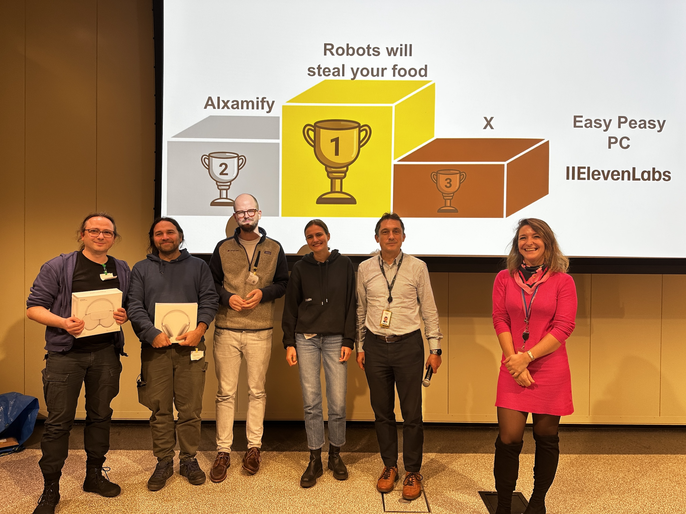

### Bootstrapping Research Agents

<table>
<tr>
<td>

1. https://github.com/apps/desktop  <small>(only if you are not using git daily)</small>
2. https://www.jetbrains.com/idea/  <small>(only if you want to try Kotlin)</small>
3. https://github.com/xemantic/ | clone:
   - [xemantic-ai-workshop](https://github.com/xemantic/xemantic-ai-workshop)
   - [claudine](https://github.com/xemantic/xemantic-ai-workshop)
4. https://platform.claude.com/  <small>(only if you want to try Kotlin)</small>
5. FORESIGHT_API_KEY="sk-33489d6e26ce4073ae690be9cea780b6"

</td>
<td style="width: 20%;">

<small>[discord](https://discord.gg/vQktqqN2Vn)</small>

<small>presentation</small>

</td>
</tr>
</table>

<small>https://xemantic.com/ai/workshops/foresight</small>

---
## Agenda

- **10:00**: doors open
- **11:00–13:00**: introduction to Agentic AI (part 1)
- **13:00**: lunch
- **14:00–15:00**: introduction to Agentic AI (part 2)
- **15:00**: building together till late night :)

_5-minute breaks provided at the top of each hour_

---
## Don't be shy to ask questions

This knowledge is just few months old - every question is relevant, and we can try to answer them together.

---
## About Foresight Institute

https://foresight.org/

---
## About Xemantic

- AI research (cognitive science)
- humanistic computation
- applied philosophy
- computational, immersive art

🏠 [Prachtsaal](https://prachtsaal.berlin) art community / Neukölln

<https://xemantic.com> | <https://github.com/xemantic>

---
## 404
### Xemantic's immersive work

<iframe width="560" height="315" src="https://www.youtube.com/embed/Hb-P2f0cyMI?si=uDb8Uo-zzsxmzXtT" title="YouTube video player" frameborder="0" allow="accelerometer; autoplay; clipboard-write; encrypted-media; gyroscope; picture-in-picture; web-share" referrerpolicy="strict-origin-when-cross-origin" allowfullscreen></iframe>

---
### Xemantic @ Hackathons

    

AI Hack Berlin 2024 | [AI4Science](https://luma.com/70jztzt8?tk=ePTkUF)

---
# Introductions

What's your expectation from the workshop.

---
## Agentic AI

- prompt engineering
- context engineering
- harness engineering

What makes an AI agent, **the difference between "a workflow" and "an agent"**:

https://www.anthropic.com/research/building-effective-agents

---
## Claudine
### Live session

---
# Workshop repository

---
## What you will learn?

- **Prompt Engineering**: how to talk to machines so that they listen
- **Context Engineering**: programming for LLM integration
- **Harness Engineering**: building own autonomous agents
- **Cognitive Science**: the psychological and philosophical foundation of these techniques

---
## A glossary of AI-related terms

Navigating through Agentic AI development requires particular vocabulary:

# `ai_glossary.md`

---
## Let's start with demonstrations

# `Demo01HelloWorld.kt`

---
# Back to meta ...

---
## Why is it even possible?

---
## Emergence

From evolutionary processes around we learn, that self-replicating systems composed of individual elements, when reaching certain level of complexity, start exhibiting properties and phenomena which we cannot reduce to properties of individual elements.

_Maybe we should study biology before computer science? ;)_

---
## New phenomena in Machine Learning

_from ML to AI_

- scaling laws (just throw more compute at it...)
- emergent reasoning
- emergent theory of mind

---
### Are robots gonna steal our job?

It's a very complex topic, no one can tell, but most likely **the opposite will happen**.

For sure, we need to adapt, and we need to adapt extremely fast.

---
## Thank You!
### Agentic AI & Creative Coding Workshops

You will learn how to make your own Claudine!

<https://xemantic.com/ai/workshops/>

---
