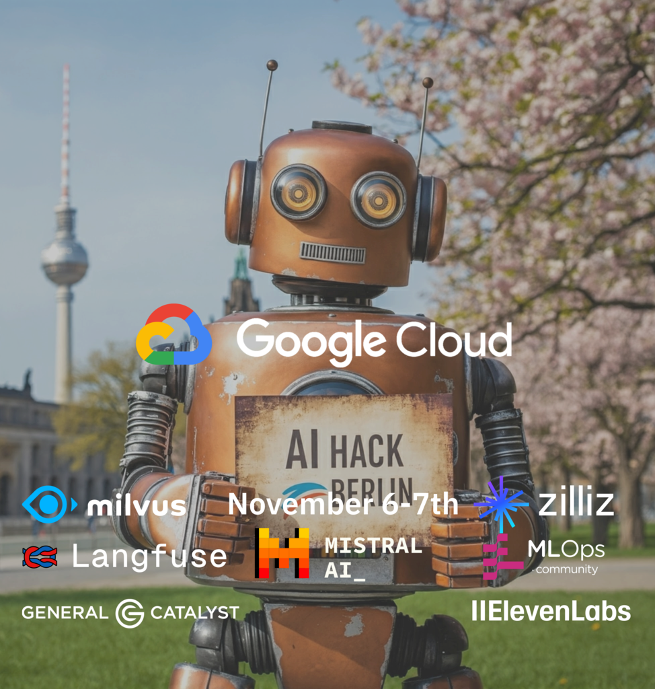

### Bootstrapping Research Agents

<table>
<tr>
<td style="width: 20%;">

<small>presentation</small>

</td>
<td><small>

1. https://github.com/apps/desktop  <small>(only if you are not using git daily)</small>
2. https://www.jetbrains.com/idea/  <small>(only if you want to try Kotlin)</small>
3. https://github.com/xemantic/ | clone:
   - [xemantic-ai-workshop](https://github.com/xemantic/xemantic-ai-workshop)
   - [claudine](https://github.com/xemantic/xemantic-ai-workshop)
4. https://platform.claude.com/  <small>(only if you want to try Kotlin)</small>
5. FORESIGHT_API_KEY="sk-33489d6e26ce4073ae690be9cea780b6"

</small></td>
<td style="width: 20%;">

<small>[discord](https://discord.gg/vQktqqN2Vn)</small>

</td>
</tr>
</table>

https://xemantic.com/ai/workshops/foresight

---
### Software to install

---
## Agenda

- **10:00**: Kotlin crash course
- **11:00**: introductions, expectations
- **11:30**: setting up our environments (hello world)
- **12:00**: quick session with Claudine AI agent
- **13:00**: lunch break
- **14:00**: going through examples and experimenting
- **16:00**: discussion on AI philosophy and ethics

_5-minute breaks provided at the top of each hour_

---
## Don't be shy to ask questions

This knowledge is just few months old - every question is relevant, and we can try to answer them together.

---
## Foresight Institute

---
## Xemantic

Xemantic is a collective of applied philosophy based at [Prachtsaal](https://prachtsaal.berlin) cooperative, founded by Julia Thomas and Kazik Pogoda, conducting independent AI research and creating immersive computational art.

We publish our research as open source software.

<https://xemantic.com>

<https://github.com/xemantic>

---
## 404
### Xemantic's immersive work

<iframe width="560" height="315" src="https://www.youtube.com/embed/Hb-P2f0cyMI?si=uDb8Uo-zzsxmzXtT" title="YouTube video player" frameborder="0" allow="accelerometer; autoplay; clipboard-write; encrypted-media; gyroscope; picture-in-picture; web-share" referrerpolicy="strict-origin-when-cross-origin" allowfullscreen></iframe>

---
### Xemantic @ AI hack Berlin

    

---
### Robots will steal your food

    

---
# Introductions

What's your expectation from the workshop.

---
## Agentic AI

- prompt engineering
- context enginnering
- harness engineering

What makes an AI agent, **the difference between "a workflow" and "an agent"**:

https://www.anthropic.com/research/building-effective-agents

---
## Why Anthropic?

---
## Claudine
### Live session

<https://github.com/xemantic/claudine/>

---
# Workshop repository

---
## What you will learn?

- **Context Engineering**: programming for LLM integration
- **Cognitive Science**: the psychological and philosophical foundation of a technique
- **Kotlin**: particular Kotlin idioms used in the source code

---
## A glossary of AI-related terms

Navigating through Agentic AI development requires particular vocabulary:

# `ai_glossary.md`

---
## Let's start with demonstrations

# `Demo01HelloWorld.kt`

---
# Back to meta ...

---
## Why is it even possible?

---
## Emergence

From evolutionary processes around we learn, that self-replicating systems composed of individual elements, when reaching certain level of complexity, start exhibiting properties and phenomena which we cannot reduce to properties of individual elements.

_Maybe we should study biology before computer science? ;)_

---
## New phenomena in Machine Learning

_from ML to AI_

- scaling laws (just throw more compute at it...)
- emergent reasoning
- emergent theory of mind

---
## The tectonic paradigm shift

... in virtually everything, but it starts with software

<https://darioamodei.com/machines-of-loving-grace>

---
### Are robots gonna steal our job?

It's a very complex topic, no one can tell, but most likely **the opposite will happen**.

For sure, we need to adapt, and we need to adapt extremely fast.

---
### What does Agentic AI imply for software development?

**Stop the world! ... and rethink.**

We are at the tipping point. Every project we are working on at the moment might be obsolete when we release it.

---
## Rethink the tools we are using

"AI-assisted development" vs "assisting AI in development"

---
### Agentic AI principles

1. A language model with emergent reasoning capabilities.
2. Well documented (therefore internalized by the model) information exchange standard.
3. Vast amount of data to operate on.

What can you substitute for these categories at Bonial?

---
## AI & Philosophy

Dario Amodei, Anthropic's CEO, wrote [Machines of Loving Grace](https://darioamodei.com/machines-of-loving-grace#5-work-and-meaning) - an extremely insightful essay on machine intelligence, with predictions for the upcoming decade.

---
## Thank You!
### Agentic AI & Creative Coding Workshops

You will learn how to make your own Claudine!

<https://xemantic.com/ai/workshops/>

---
