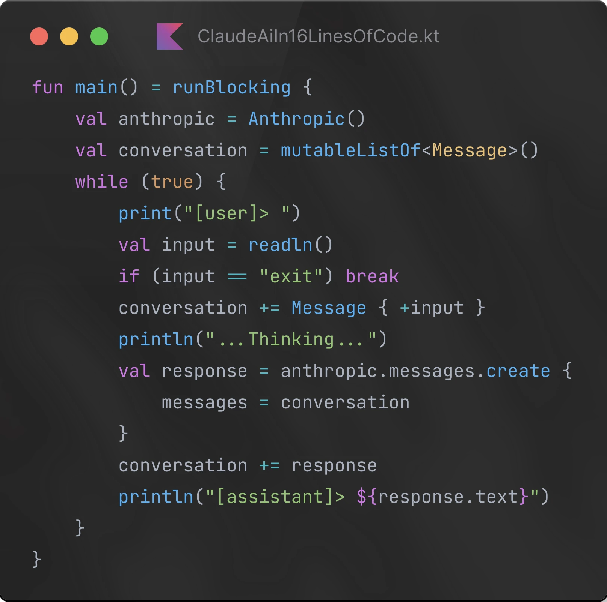
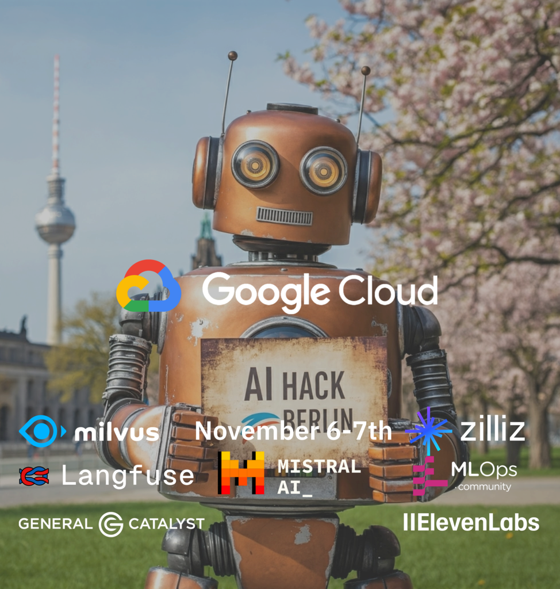
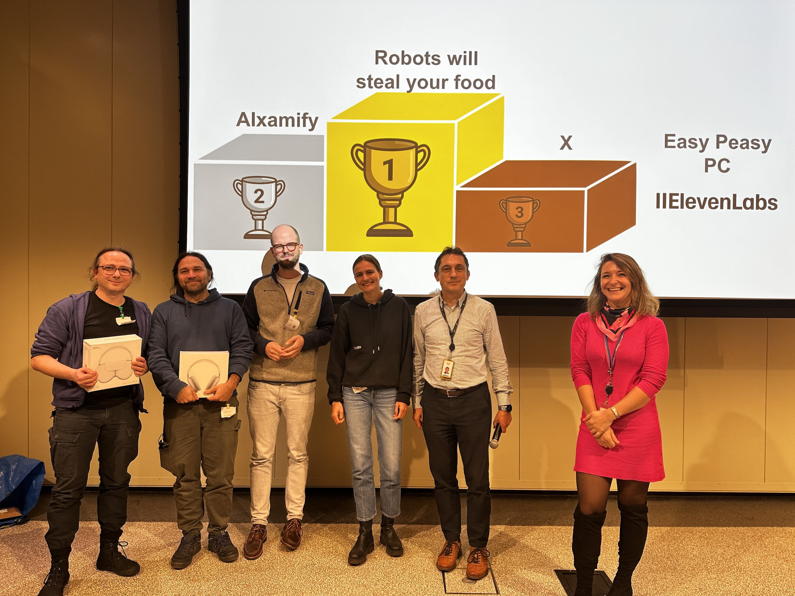

# Agentic AI & Creative Coding workshops



## Invitation

We are <a href="https://xemantic.com/">Xemantic</a>, an applied philosophy collective based in Berlin, offering workshops on <b>building powerful AI agents</b>. Your instructor, [Kazik Pogoda](#about-kazik-your-instructor), will take you on a journey of developing autonomous and highly potent AI systems, like [Claudine AI agent](https://github.com/xemantic/claudine/), capable of fully controlling a Unix-compliant machine (which also means your computer, even if you are using Windows ;) ). Claudine won [AI hack Berlin](https://rsvp.withgoogle.com/events/ai-hack-berlin) hackathon.



## You will learn ...

- The glossary of AI development terms.
- How to write custom conversational bots using [Anthropic API](https://www.anthropic.com/) - as a prerequisite for building agents.
- How to engineer prompts for agents, moving beyond the simple conversational AI paradigm - natural language is becoming a powerful programming language.
- How to use structured output from a model for parsing data from unstructured sources - extracting semantic information from images and documents.
- How to give tools (function calling) to your agent, so it can interact with your machine.
- How to adapt these tools to IT systems of your organization.
- How to assist [Claudine](https://github.com/xemantic/claudine) agent in using your computer and coding - where the traditional roles of human and machine are reversed.
- The architecture and meta-principles behind design powerful AI agents.
- Anthropic's [Model Context Protocol](https://modelcontextprotocol.io/), which standardizes how applications provide context to LLMs.
- A bit on AI ethics, privacy, security considerations and alignment.

*You will gain access to workshop repository tailored to this educational path, with approachable and well commented examples and blueprints, often illustrated with elements of creative coding on top of [OPENRNDR](https://openrndr.org/) framework (we are also contributors of), therefore self-explaining and fun to work with.*

## Backstory

Machines are becoming more intelligent with every single day and keeping pace with their exponential advancement has become a full-time endeavor. We are entering the **Agentic AI era**, which creates unprecedented possibilities for software developers, to integrate our systems with autonomous reasoning of non-human origin.

Here, at Xemantic, we have been conducting independent AI research through the lenses of applied philosophy, which led us to some unique discoveries, and resulted in extensive collection of [open source AI libraries](../), making creation of Agentic AI very approachable, especially for developers working with [Kotlin](https://kotlinlang.org/) and Java/JVM stack.

If you are not familiar with Kotlin, don't worry, the workshop starts with optional Kotlin crash course, and all the code examples presented during the workshop are minimal and self-explanatory. **What matters here, is not the implementation language, but the meta-theory of writing powerful AI agents. And this is the main focus of the workshop.**

We had a chance of validating the value of our research during the [AI hack Berlin](https://rsvp.withgoogle.com/events/ai-hack-berlin) hackathon at Google. Together with [Victor Diaz](https://github.com/victordiaz) we formed our *ad hoc* "Robots will steal your food" team, which presented an autonomous AI agent, freely controlling a remote Unix machine, according to intentions expressed in simple sketches created by the user in the web browser. Our team won the hackathon.



## About Kazik, your instructor

An independent AI researcher, open source enthusiast, open society advocate, computational artist and live coder. A programmer and software architect by trade, a philosopher by education, interested in cognitive science and ethics. Co-founder of [Xemantic](https://xematnic.com/) (applied philosophy collective) and [Prachtsaal](https://prachtsaal.berlin) (non-profit art cooperative).


## Dates

We are offering workshops on Tuesdays, between 10:00-17:00, in February and March 2025, starting from:

* 18.02.2025
* 25.02.2025
* 04.03.2025
* 11.03.2025
* 18.03.2025
* 25.03.2025

*In case of popularity of the workshop, more dates will follow, including sessions on the weekend. If you want to take the workshop, and none of these dates fit you, please write to <office@xemantic.com>. For bigger groups we can consider also other days, and most likely we will also offer some workshops over the weekend.*

If you want to stay informed, [subscribe to our newsletter](#newsletter).

## Tickets

Tickets must be obtained in 2 steps:

### 1. Choose a date and book a free ticket

Open: <https://opencollective.com/xemantic/events>

Pick the date of your workshops. This way we can track the attendance.

### 2. Gain access to workshop's GitHub repository

Open: <https://github.com/sponsors/xemantic>

Choose: Here is the repository link:

<https://github.com/xemantic/xemantic-ai-workshop>

Note: The repository can be accessed only after sponsoring Xemantic on GitHub:


You have to choose 

*You are more than welcome to become a monthly sponsor, especially if you will use our open source software in your own commercial solutions.*

*If for some reason, GitHub sponsors is not feasible, please write me an email.*

**

*We also offer a **solidarity ticket**, for students, If you want to take a workshop, but cannot afford the one time sponsorship on GitHub, please sponsor us one time, only as much as you can, and then write us a message to access the workshop repository* 

*Each time we can host up to 15 participants.*

## Location

All the workshops are held at [Prachtsaal](https://prachtsaal.berlin), a non-profit art cooperative, hosting many resident artists, including our Xemantic collective. Prachtsaal is located in Neukölln, between Körnerpark and Tempelhof. Workshops are happening at our Venue, while in our Foyer you can experience the art exhibition, get some drinks, and take a break in our garden while talking to artists, maybe buying an artwork?

Cafe Augusta, in front of the building, is serving delicious coffee and food, there are also numerous lunch options in the area.

```
Jonas Str. 22
12053
Berlin, Neukolln
```

## Requirements

### Bringing own laptop can be beneficial ;)

All the examples will be shared and commented on the projection screen, therefore the workshop can be received passively as a lecture, but having own machine, or sharing it with a friend in a pair-programming mode, will probably bring the most value.

### Anthropic API key

All the examples executed during the workshops required access to Anthropic API which is a paid service. Before the workshops you need to load some credits. The minimal amount is $5, but it should be enough compute for the whole workshop.

Important: Anthropic API credits are different from Claude subscription.

### Make sure you have Kotlin-IDE (unless you come earlier)

If you are not attending the very first hour of the workshop, where we are installing IntelliJ IDE and have a Kotlin crash-course, then you need to make sure that you have either IntelliJ IDE (Open Source community edition is fine), or Andorid Studio installed.

A very basic programming experience is needed. The workshop is using very basic programming as a vehicle of exploring much broader topics. During the workshop Kotlin is used as an implementation language. If you are not familiar with Kotlin, and you want to get a crush course the 

### Code of Conduct

Our workshop adheres to the [Berlin Code of Conduct](https://berlincodeofconduct.org/), and we are committed to providing a friendly, safe and welcoming environment for all, regardless of gender, sexual orientation, ability, ethnicity, socioeconomic status and religion (or lack thereof).

## Workshop agenda

- 10:00-10:50 Kotlin crash course
- 11:00-11:13 Setting up environment
- 12:00-13:00 Workshop part 1
- 13:00-14:00 Lunch break
- 14:00-15:50 Workshop part 2
- 15:00-16:00

*The gaps between can be used for breaks*

## Frequently Asked Questions

### How much programming skills do I need before taking the workshop?

The source code repository used during the workshop can be used in "clone & play" mode, even with rudimentary programming knowledge, therefore it should be accessible to programmers of all levels of expertise. We are focusing on teaching programming related to AI, and ability of expressing concepts in natural langauge is actually far more important than particular programming proficiency.

### Can you run the workshop at the office of my company?

Of course, the format of the workshop is not bound to particular location. If you are an organizer, please write directly to edu@xemantic.com. Otherwise, please share this page with the person who can invite Xemantic to the premises of your organization.

### Is it possible to take part in the workshop remotely?

We are working on that. Depending on the popularity, we might also consider a pre-recorded version of the workshop published on YouTube.

### Why using Kotlin for AI development?

Here are the benefits of using Kotlin for AI development:

- [**Domain Specific Languages**](https://en.wikipedia.org/wiki/Domain-specific_language): E.g. a new DSL, provided with unofficial Xemantic's [anthropic-sdk-kotlin](https://github.com/xemantic/anthropic-sdk-kotlin), delivers unprecedented ease of use of Large Language Models.
- **Educational focus**: Minimal syntax, with maximal outcome and no boilerplate, are perfect as an introduction to writing AI Agents.
- [**Multiplatform by default**](https://kotlinlang.org/docs/multiplatform.html): Such an agent, written once, can be compiled for any platform.
- **Code generation**: LLMs "like" to output Kotlin code, thanks to minimal verbosity (e.g. [type inference](https://kotlinlang.org/spec/type-inference.html)) and features like [extension functions](https://kotlinlang.org/docs/extensions.html#extension-functions).

At the same time the amount of AI development-related libraries is very scarce. We are trying to change it! 

