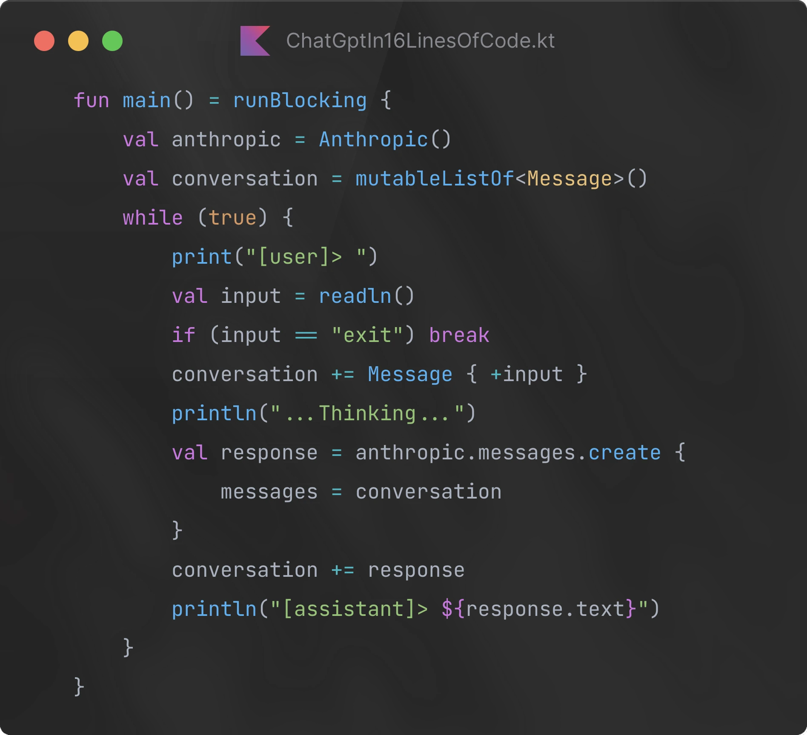

# Agentic AI & Creative Coding workshops



## Invitation

We are <a href="https://xemantic.com/">Xemantic</a>, applied philosophy collective from Berlin, and we would like to invite you to our workshops, where you will learn <b>how to write powerful AI agents</b>. Your instructor, [Kazik Pogoda](#about-kazik-your-instructor), will take you on a journey of developing autonomous and highly potent AI systems, like [Claudine AI agent](https://github.com/xemantic/claudine/), capable of fully controlling a Unix-compliant machine (which also means your computer, even if you are using Windows ;) ).

Claudine won AI hack Berlin hackathon.


## You will learn ...

- A glossary of AI related terms.
- How to write custom conversational bot?
- How to utilize so-called structured generation?
- How to give agent tools, so it can interact with your machine?
- How to adapt these tools to IT systems and needs of your organization?
- How to assist Claudine AI in using your computer and coding (indeed, the roles are reversing)?
- Ethical alignment

All of this as approachable as possible, illustrated with elements of creative coding for boosting fun factor and accessibility.

## Backstory

Machines are becoming more intelligent with every single day and keeping up with their advancement is becoming a job on its own. We are entering the Agentic AI era, which creates unprecedented possibilities for software developers, to integrate our systems with machine-based autonomous reasoning.

Since few months I've been conducting my independent AI research, which led me to some unique discoveries, and resulted in plethora of [open source AI libraries](../), which make creation of Agentic AI super-approachable, especially for Kotlin and Java/JVM stack developers.

Together with [Victor Diaz]() we won AI Hack Berlin hackathon, while introducing the team "Robots will steal your food", which presented an autonomous, omnipotent, open source AI agent named
<a href="https://github.com/xemantic/claudine/">Claudine</a>.


## About Kazik, your instructor

I am an independent AI researcher, open source enthusiast, open society advocate, computational artist and live coder. A programmer and software architect by trade, a philosopher by education, interested in cognitive science and ethics. Co-founder of [Xemantic](https://xematnic.com/) (applied philosophy collective) and [Prachtsaal](https://prachtsaal.berlin) (non-profit art cooperative).


## Dates

There will be a workshop every Tuesday in February and March 2025:

* 11.02.2025
* 12.02.2025

## Tickets

Tickets must be obtained in 2 steps

### 1. Choose date

Go to [Xamantic page at OpenCollective](https://opencollective.com/xemantic/events/agentic-ai-for-artists-d521d16e)

### 2. Gain access to workshop GitHub repository

The repository is:

https://github.com/xemantic/xemantic-ai-workshop

Most likely you cannot see it, because you need to sponsor Xemantic first through the GitHub sponsors program.

> [!NOTE]
> If for some reason GitHub sponsors is not feasible, please write me an email.

## Location

All the workshops are happening at [Prachtsaal](https://prachtsaal.berlin), a non-profit art cooperative, hosting many resident artists, including our Xemantic collective. Prachtsaal is located on Neukölln, between Körnerpark and Tempelhof. Workshops are happening at our Venue, while in our Foyer you can experience the art exhibition, get some drinks, and take a break in our garden while talking to artist, maybe buying an artwork?

Cafe Augusta in front of the building is serving delicious coffee and food, there are also many other lunch options around.

```
Jonas Str. 22
12053
Berlin, Neukolln
```

## Requirements

### You need your own machine!

Obviously you need to **bring your laptop**. :)

### Anthropic API key

All the examples executed during the workshops required access to Anthropic API which is a paid service. Before the workshops you need to load some credits. The minimal amount is $5, but it should be enough compute for the whole workshop.

Important: Anthropic API credits are different from Claude subscription.

### Make sure you have Kotlin-IDE (unless you come earlier)

If you are not attending the very first hour of the workshop, where we are installing IntelliJ IDE and have a Kotlin crash-course, then you need to make sure that you have either IntelliJ IDE (Open Source community edition is fine), or Andorid Studio installed.

A very basic programming experience is needed. The workshop is using very basic programming as a vehicle of exploring much broader topics. During the workshop Kotlin is used as an implementation language. If you are not familiar with Kotlin, and you want to get a crush course the 

## Workshop agenda

- 10:00 Introduction to Kotlin
- 11:00-11:50 Regular workshop starts
- 11:50-12:00 break
- 12:00-12:50 asdfsadf  
- 13:00-14:00 Lunch break
- 14:00-15:00 
- 15:00-16:00

## Workshop at your organization

It is possible to take the workshops at the office of your organization. If this is your desire, please write us.
