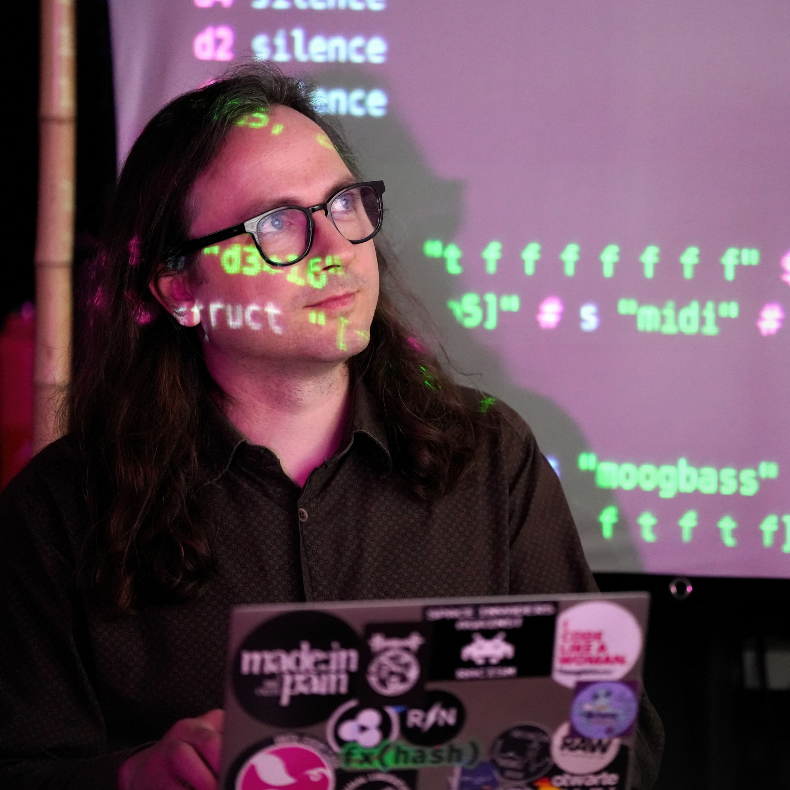

# Agentic AI & Creative Coding Workshops

## Invitation

### Do you want to learn how to build your own AI agents?

We are [Xemantic](https://xemantic.com/), offering intensive one-day workshops on **building powerful AI agents**. Your instructor, [Kazik Pogoda](#about-kazik-your-instructor), will take you on a journey of developing autonomous and highly potent AI systems, like [Claudine AI agent](https://github.com/xemantic/claudine/), capable of fully controlling your machine. Claudine won [AI hack Berlin](https://rsvp.withgoogle.com/events/ai-hack-berlin) hackathon.

## What You Will Learn

- Master the essential **glossary** of AI development terms
- Build **custom conversational bots** using the [Anthropic API](https://www.anthropic.com/) as a foundation for agent development
- Design and **engineer prompts for agents**, moving beyond simple conversational AI — natural language becomes your new programming paradigm
- Extract **structured output** from unstructured sources through model parsing (e.g. documents, images)
- Give **tools to your agent** (function calling), so it can interact with your machine
- How to **integrate an agent with IT systems** of your organization (discussion with examples)
- How to assist [Claudine](https://github.com/xemantic/claudine) agent in using your computer and autonomous coding - where traditional roles of human and machine are reversed.
- Understand the architecture and meta-principles of powerful AI agents
- Apply Anthropic's [Model Context Protocol](https://modelcontextprotocol.io/), which standardizes how applications provide context to LLMs.
- Navigate AI ethics, privacy, security, and alignment considerations

*You'll gain access to a tailored workshop repository featuring approachable, well-documented examples and blueprints. These are illustrated using the [OPENRNDR](https://openrndr.org/) creative coding framework (to which we are contributors), making them both self-explanatory and engaging.*

## Backstory

Machines are becoming more intelligent every day, and keeping pace with their exponential advancement has become a full-time endeavor. We are entering the **Agentic AI era**, which creates unprecedented possibilities for software developers to integrate systems with autonomous, non-human reasoning.

At Xemantic, we conduct independent AI research through the lens of applied philosophy. This work has led to unique discoveries and an extensive collection of [open source AI libraries](../#xemantics-open-source-ai-software). These tools make Agentic AI development highly approachable, especially for developers working with the [Kotlin](https://kotlinlang.org/) and Java/JVM stack.

*Not familiar with Kotlin? Don't worry — the workshop begins with an optional Kotlin crash course, and all code examples are minimal and self-explanatory. **What matters here is not the implementation language but the meta-theory of writing powerful AI agents, which is the main focus of the workshop.***

We had a chance of validating the value of our research during the [AI hack Berlin](https://rsvp.withgoogle.com/events/ai-hack-berlin) hackathon at Google. Together with [Victor Diaz](https://github.com/victordiaz) we formed our *ad hoc* "Robots will steal your food" team, which presented an autonomous AI agent, freely controlling a remote Unix machine, according to intentions expressed in simple sketches created by the user in the web browser. Our team won the hackathon.

## About Kazik, Your Instructor

Kazik is an independent AI researcher, open source enthusiast, open society advocate, computational artist, and live coder. With a background as a programmer and software architect by trade and philosopher by education, he brings deep expertise in cognitive science and ethics. He is the co-founder of [Xemantic](https://xemantic.com/) (an applied philosophy collective) and [Prachtsaal](https://prachtsaal.berlin) (a non-profit art cooperative).

## Workshop Dates

We offer workshops on Tuesdays from 10:00 to 17:00 in February and March 2025:

* February 25, 2025
* March 4, 2025
* March 11, 2025
* March 18, 2025
* March 25, 2025

*Additional dates, including weekend sessions, may be added based on demand. If none of these dates work for you, please contact us at <office@xemantic.com>. We can also arrange alternative dates for larger groups.*

If you want to stay informed, [subscribe to our newsletter](#newsletter).

## Tickets

**Regular Price: 150 EUR**

*25% of proceeds support the [Prachtsaal](https://prachtsaal.berlin) non-profit cooperative.*

Registration is a two-step process:

### Step 1: Reserve Your Spot

1. Visit <https://opencollective.com/xemantic/events>
2. Select your preferred workshop date
3. Book your free reservation ticket

*Space is limited to 15 participants per workshop.*

### Step 2: Gain Workshop Access

1. Visit the [Agentic AI Workshop Tier](https://github.com/sponsors/xemantic/sponsorships?tier_id=464965) on GitHub Sponsors (GitHub account required)
2. Complete the payment
3. Gain immediate access to the workshop repository (required for participation): <https://github.com/xemantic/xemantic-ai-workshop>

**Important Notes:**

- The *Agentic AI & Creative Coding Workshop Tier* is a **monthly sponsorship tier** providing access to the workshop repository. **If you don't need this access anymore, please cancel your sponsorship after the workshop**.
- If you find our workshop helpful, and continue using our open source software, we strongly encourage you to [keep sponsoring Xemantic](https://github.com/sponsors/xemantic), at the contribution amount of your choosing.
- To retain workshop repository access, email <office@xemantic.com>
- For alternative payment methods or direct B2B invoices in Germany, contact <office@xemantic.com> (+19% VAT applies)

### Solidarity Tickets

We offer reduced-price tickets for those who need them:

1. Email <office@xemantic.com> with your GitHub username and request for a solidarity ticket
2. Upon confirmation, you'll receive repository access (no questions asked)
3. Make a one-time [GitHub sponsorship](https://github.com/sponsors/xemantic?frequency=one-time) in any amount you can afford

We are looking forward to seeing you at Prachtsaal!

## Location

The workshops take place at [Prachtsaal](https://prachtsaal.berlin), a vibrant non-profit art cooperative in Berlin's Neukölln district. As home to many resident artists, including our [Xemantic](https://xemantic.com) collective, it offers a unique and inspiring learning environment.

### Venue Highlights

- Located between Körnerpark and Tempelhof
- Workshop space in our main venue
- Art exhibition in the foyer
- Garden area for breaks
- Opportunities to meet resident artists and view their work

### Dining Options

- [Café Augusta](https://cafeaugusta.de/) directly in front of the building offers excellent coffee and food
- Numerous restaurants and cafés within walking distance

<iframe src="https://www.google.com/maps/embed?pb=!1m18!1m12!1m3!1d4860.810281427363!2d13.43115427705981!3d52.47179983979637!2m3!1f0!2f0!3f0!3m2!1i1024!2i768!4f13.1!3m3!1m2!1s0x47a84f09c11740b7%3A0x9f3c3a7993df62cc!2sPrachtsaal%20Studio!5e0!3m2!1sen!2sde!4v1739059455750!5m2!1sen!2sde" style="border:0;" allowfullscreen="" loading="lazy" referrerpolicy="no-referrer-when-downgrade"></iframe>

### Address

<address>
Prachtsaal
Jonasstraße 22
12053 Berlin
</address>

## Technical Requirements

### Laptop Requirements (Recommended)

While you can attend the workshop as a lecture-style participant, bringing a laptop is highly recommended for hands-on practice. You may work individually or pair with another participant.

Your laptop should meet these specifications:

- Minimum 8GB RAM
- 4GB free disk space
- Any modern CPU (minimal local processing required)

*All examples will be demonstrated on screen and explained thoroughly.*

### Anthropic API Access

You'll need an Anthropic API key to participate in the hands-on exercises:

1. Visit the [Anthropic billing console](https://console.anthropic.com/settings/billing)
2. Add a minimum of $5 credit (sufficient for the entire workshop)

**Important:** Anthropic API credits are separate from [Claude.ai](https://claude.ai/) subscriptions. You'll need API credits specifically.

### Development Environment

You'll need a Kotlin-compatible IDE. Either:
- [IntelliJ IDEA](https://www.jetbrains.com/idea/) (Community Edition is sufficient)
- Android Studio

*Note: If you attend the first hour (10:00-11:00), we'll guide you through IDE installation and provide a Kotlin crash course.*

## Workshop Schedule

10:00 - 17:00 (Tuesday)

* **10:00 - 11:00**: Kotlin Crash Course (Optional)
* **11:00 - 11:30**: Introduction & Setup
* **11:30 - 13:00**: Morning Session
* **13:00 - 14:00**: Lunch Break
* **14:00 - 17:00**: Afternoon Session

*5-minute breaks provided at the top of each hour*

## Code of Conduct

Our workshop adheres to the [Berlin Code of Conduct](https://berlincodeofconduct.org/), and we are committed to providing a friendly, safe and welcoming environment for all, regardless of gender, sexual orientation, ability, ethnicity, socioeconomic status and religion (or lack thereof).

## Frequently Asked Questions

### What level of programming experience is required?

Our workshop is designed to be accessible to developers of all skill levels. The key requirements are:

- Basic programming concepts understanding
- Ability to express ideas in natural language
- Willingness to learn and experiment

The [workshop repository](https://github.com/xemantic/xemantic-ai-workshop) features self-explanatory code that follows a "clone, modify, play" approach. **Natural language skills are more crucial than advanced programming expertise** for this workshop.

*Beginners are encouraged to attend the optional Kotlin crash course at 10:00.*

### Do you offer on-site corporate workshops?

Yes! We can deliver the workshop at your company location.

- For organizers: Contact us directly at <office@xemantic.com>
- For employees: Share our workshop page (<https://xemantic.com/ai/workshops>) with your team leader or HR department

### Is it possible to take part in the workshop remotely?

We are working on that. Depending on popularity, we might also consider a pre-recorded version of the workshop published on YouTube.

### Why Kotlin for AI Development?

Kotlin offers unique advantages for AI development:

1. **Powerful Language Features**
    - [Domain-Specific Languages](https://en.wikipedia.org/wiki/Domain-specific_language) support
    - Our [anthropic-sdk-kotlin](https://github.com/xemantic/anthropic-sdk-kotlin) simplifies LLM integration
    - [Extension functions](https://kotlinlang.org/docs/extensions.html#extension-functions) for elegant APIs

2. **Developer-Friendly**
    - Clean, minimal syntax
    - Reduced boilerplate code
    - Excellent for learning and teaching

3. **Technical Benefits**
    - [Multiplatform support](https://kotlinlang.org/docs/multiplatform.html) for cross-platform deployment
    - [Type inference](https://kotlinlang.org/spec/type-inference.html) for concise code
    - Optimal for LLM code generation

*While Kotlin AI libraries are currently limited, we're actively working to expand the ecosystem.*
