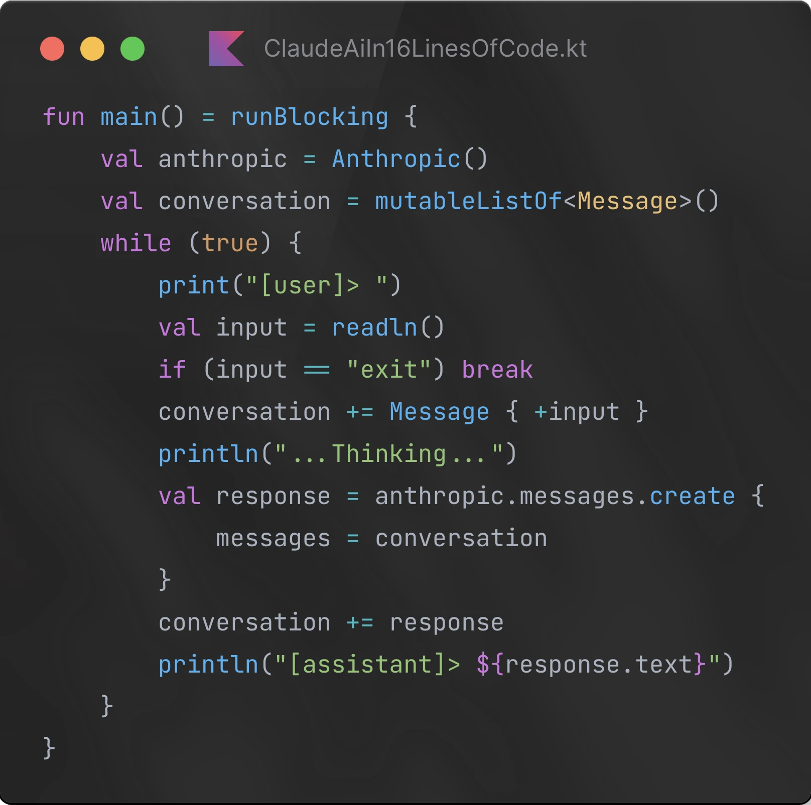
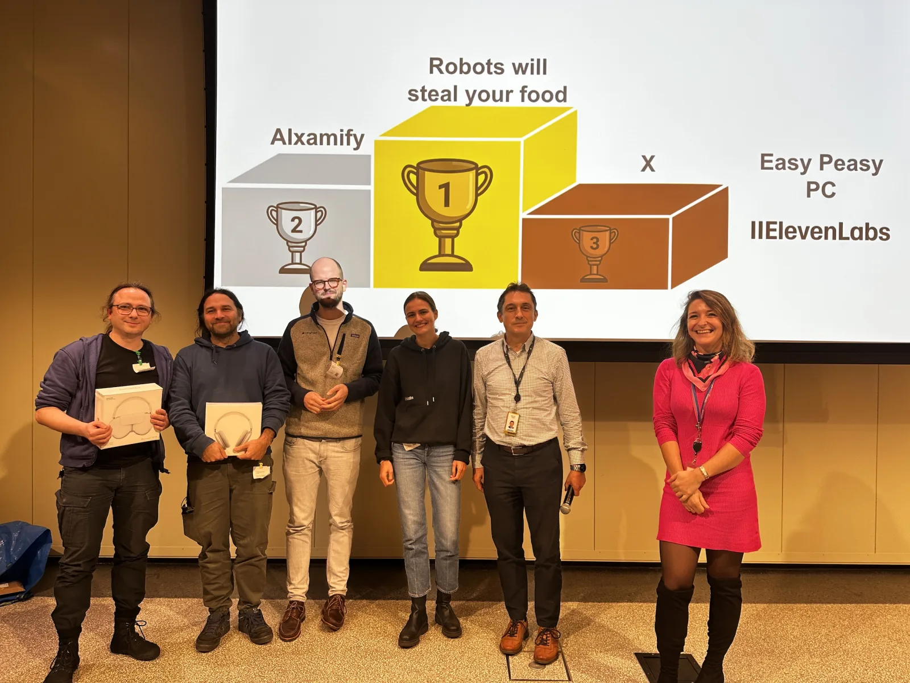
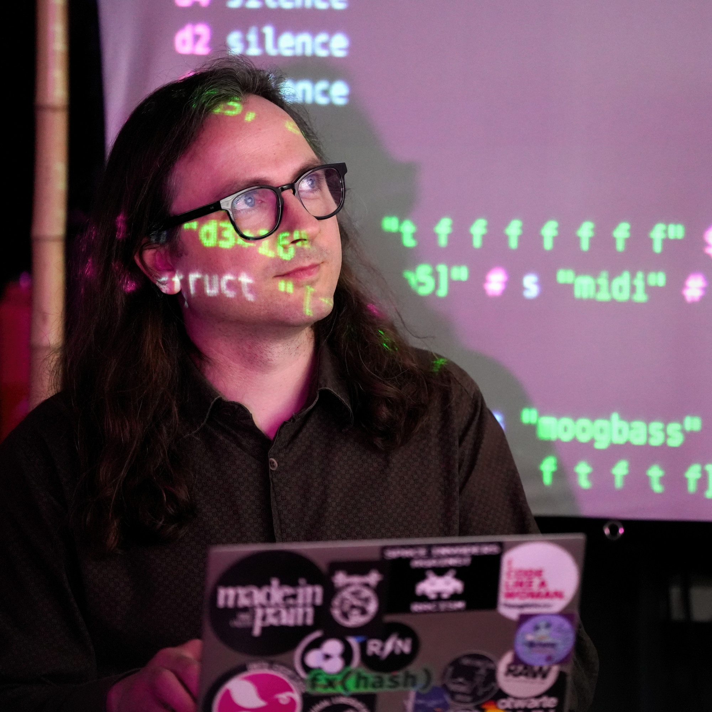
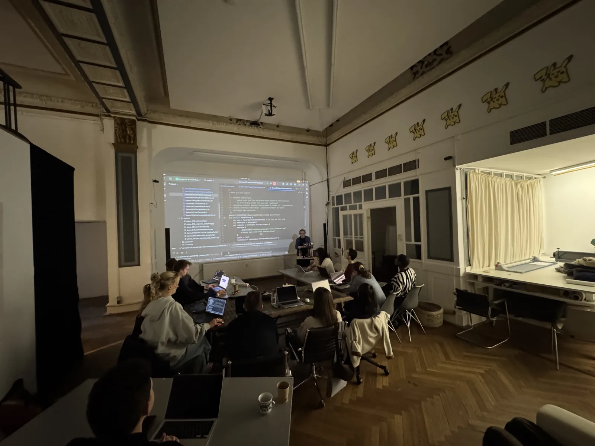

# Xemantic AI Workshops

## Invitation

### Do you want to build your own ChatGPT, Claude Code or OpenClaw?

But why would you build these tools if you can just use them? Learning simple yet powerful patterns of context and **harness engineering** lets you:

- use any existing agentic AI tools to full extent by understanding their internal mechanics
- augment your projects with a machine-reasoning layer
- autonomously conduct parts of your scientific research

We are [Xemantic](https://xemantic.com/), offering intensive one-day workshops and buildathons on **building powerful AI agents**. Your instructor, [Kazik Pogoda](#about-kazik-your-instructor), will take you on a journey of developing autonomous and highly capable AI systems, like [Claudine](https://github.com/xemantic/claudine/) (older sister of Claude Code) and [Golem XIV](https://github.com/xemantic/golem-xiv) (a metacognitive AI system with knowledge-graph memory and self-directed research).

Since 2025, Xemantic has trained more than a hundred people — individuals as well as whole organizations — in the arcane of Agentic AI, with applications in scientific research, creative technologies, management, and beyond, while winning [AI Hack Berlin 2024](https://rsvp.withgoogle.com/events/ai-hack-berlin/home) at Google and mentoring the Agentic AI track at the [Berlin Bio × AI Hackathon](https://www.biohack.berlin/).

## Workshop Editions

We currently offer three editions, sharing a common core curriculum but tailored to different audiences.

### Bootstrapping Research Agents — Hands-On for Scientists

A new edition organized in collaboration with the [Foresight Institute](https://foresight.org/), tailored to researchers and scientists. Focuses on building agents that assist scientific work — parsing literature, extracting structured data from papers, and connecting to research sources. Held at the [Foresight Institute](https://foresight.org/)'s Berlin AI Node, part of the [AI for Science & Safety programme](https://foresight.org/grants/grants-ai-for-science-safety/).

*Registration via a dedicated lu.ma page — link coming soon.*

### Hands-On Agentic AI for Tech Teams

Tailored to tech teams at startups and established companies — software developers and data scientists benefit most, but only minimal programming skills are required, making it accessible to colleagues from management, product, and other functions. Can be held either at your organization's premises or at [Prachtsaal](#prachtsaal).

### Agentic AI & Creative Coding

Our edition for developers, artists, and creative technologists. Examples are illustrated using the [OPENRNDR](https://openrndr.org/) creative coding framework, making agentic concepts tangible through visual, generative work. Held at [Prachtsaal](#prachtsaal) in Berlin's Neukölln district.

## Happy Customers

Organizations whose teams we've trained:

- [dvlp.energy](https://www.dvlp.energy/)
- [Bonial](https://www.bonial.com/en/)
- [ImmoScout24](https://www.scout24.com/)

> Thank you for having us at Pratchsaal! The workshop you prepared for us was very insightful 💡 we’re already brainstorming multiple ideas how to incorporate AI agents in the dvlp.energy platform! I’m excited about how this technology could improve our product and day-to-day workflow.
> 
> -- [Oliwia Golec](https://www.linkedin.com/in/oliwia-golec-3678a7114/), Co-founder & CTO @ dvlp.energy

## What You Will Learn

- Master the essential **glossary** of AI development terms
- Build **custom conversational bots** using the [Anthropic API](https://www.anthropic.com/) as a foundation for agent development
- Design and **engineer prompts for agents**, moving beyond simple conversational AI — natural language becomes your new programming paradigm
- Extract **structured output** from unstructured sources through model parsing (e.g. documents, images)
- Give **tools to your agent** (function calling), so it can interact with your machine
- How to **integrate an agent with IT systems** of your organization (discussion with examples)
- How to assist [Claudine](https://github.com/xemantic/claudine) agent in using your computer and autonomous coding - where traditional roles of human and machine are reversed.
- Understand the architecture and meta-principles of powerful AI agents
- Navigate AI ethics, privacy, security, and alignment considerations

*You'll gain access to a tailored workshop repository featuring approachable, well-documented examples and blueprints. Examples are provided in **Python**, **TypeScript**, and **Kotlin** — since the meta-principles of agent design are language-agnostic, you can evaluate them across all three in parallel.*

*For the Creative Coding edition, examples are additionally illustrated using the [OPENRNDR](https://openrndr.org/) creative coding framework, to which we are contributors.*

## Direct discussions

Jump into the [Xemantic Discord server](https://discord.com/invite/vQktqqN2Vn) to ask questions or discuss anything related to our workshops. Our community is here to help!

## Backstory

We are entering the **Agentic AI era**, opening unprecedented possibilities for integrating software systems with autonomous, non-human reasoning. At Xemantic, we conduct independent AI research through the lens of applied philosophy — work that has led to unique discoveries and an extensive collection of [open source AI libraries](../#xemantics-open-source-ai-software), making Agentic AI development highly approachable, especially for developers working with the [Kotlin](https://kotlinlang.org/) and Java/JVM stack.

We validated this research at the [AI hack Berlin](https://rsvp.withgoogle.com/events/ai-hack-berlin) hackathon at Google, where together with [Victor Diaz](https://github.com/victordiaz) we formed the *ad hoc* "Robots will steal your food" team and won first prize with an autonomous AI agent that freely controlled a remote Unix machine based on intentions expressed in simple browser sketches.

*Not familiar with Kotlin? Don't worry — the workshop begins with an optional Kotlin crash course, and all code examples are minimal and self-explanatory. **What matters here is not the implementation language but the meta-theory of writing powerful AI agents, which is the main focus of the workshop.***

## About Kazik, Your Instructor

Kazik is an independent AI researcher, open source enthusiast, open society advocate, computational artist, and live coder. With a background as a programmer and software architect by trade and philosopher by education, he brings deep expertise in cognitive science and ethics. He is the co-founder of [Xemantic](https://xemantic.com/) (an applied philosophy collective) and [Prachtsaal](https://prachtsaal.berlin) (a non-profit art cooperative).

## Upcoming Sessions

The workshop runs as an ongoing initiative, with new dates announced regularly. Sessions typically run from 10:00 to 17:00.

For the latest schedule and to register, contact us at <office@xemantic.com>, or [subscribe to our newsletter](#newsletter) to be notified of upcoming editions.

*We can also arrange alternative dates and on-site sessions for larger groups.*

## Locations

### Foresight Institute - Berlin AI Node

Workshops held in collaboration with the [Foresight Institute](https://foresight.org/) will be hosted at [CIC Berlin](https://cic.com/de/berlin/).

### Prachtsaal

Our past workshops have been taking place at [Prachtsaal](https://prachtsaal.berlin), a vibrant non-profit art community in Berlin's Neukölln district. As home to many resident artists, including our [Xemantic](https://xemantic.com) collective, it offers a unique and inspiring learning environment.

### Venue Highlights

- Located between Körnerpark and Tempelhof
- Workshop space in our main venue
- Art exhibition in the foyer
- Garden area for breaks
- Opportunities to meet resident artists and view their work
- [Café Augusta](https://cafeaugusta.de/) directly in front of the building, plus many restaurants and cafés within walking distance

<iframe src="https://www.google.com/maps/embed?pb=!1m18!1m12!1m3!1d4860.810281427363!2d13.43115427705981!3d52.47179983979637!2m3!1f0!2f0!3f0!3m2!1i1024!2i768!4f13.1!3m3!1m2!1s0x47a84f09c11740b7%3A0x9f3c3a7993df62cc!2sPrachtsaal%20Studio!5e0!3m2!1sen!2sde!4v1739059455750!5m2!1sen!2sde" style="border:0;" allowfullscreen="" loading="lazy" referrerpolicy="no-referrer-when-downgrade"></iframe>

### Address

<address>
Prachtsaal
Jonasstraße 22
12053 Berlin
</address>

## Technical Requirements

### Laptop Requirements (Recommended)

While you can attend the workshop as a lecture-style participant, bringing a laptop is highly recommended for hands-on practice. You may work individually or pair with another participant.

Your laptop should meet these specifications:

- Minimum 8GB RAM
- 4GB free disk space
- Any modern CPU (minimal local processing required)

*All examples will be demonstrated on screen and explained thoroughly.*

### Anthropic API Access

You'll need an Anthropic API key to participate in the hands-on exercises:

1. Visit the [Anthropic billing console](https://console.anthropic.com/settings/billing)
2. Add a minimum of $5 credit (sufficient for the entire workshop)

**Important:** Anthropic API credits are separate from [Claude.ai](https://claude.ai/) subscriptions. You'll need API credits specifically.

## Code of Conduct

Our workshop adheres to the [Berlin Code of Conduct](https://berlincodeofconduct.org/), and we are committed to providing a friendly, safe and welcoming environment for all, regardless of gender, sexual orientation, ability, ethnicity, socioeconomic status and religion (or lack thereof).

## Frequently Asked Questions

### What level of programming experience is required?

Our workshop is designed to be accessible to developers of all skill levels. The key requirements are:

- Basic programming concepts understanding (Python, JavaScript, TypeScript, Swift, Java, Scala, Rust, C, C++, etc.)
- Ability to express ideas in natural language
- Willingness to learn and experiment

The [workshop repository](https://github.com/xemantic/xemantic-ai-workshop) features self-explanatory examples in **Python**, **TypeScript**, and **Kotlin**, following a "clone, modify, play" approach. **Natural language skills are more crucial than advanced programming expertise** for this workshop — since the meta-principles of agent design are language-agnostic, you can pick whichever language you're most comfortable with, or compare across all three.

*An optional Kotlin crash course can be provided, if you're new to Kotlin or want to explore Xemantic's Kotlin-based AI libraries.*

### Do you offer on-site corporate workshops?

Yes! We can deliver the workshop at your company location.

- For organizers: Contact us directly at <office@xemantic.com>
- For employees: Share our workshop page (<https://xemantic.com/ai/workshops>) with your team leader or HR department

### Is it possible to take part in the workshop remotely?

We are working on that. Depending on popularity, we might also consider a pre-recorded version of the workshop published on YouTube.

### Why does Xemantic build AI tools in Kotlin?

While our workshop examples are available in Python, TypeScript, and Kotlin, Xemantic's own AI tooling is built primarily in Kotlin. Kotlin offers unique and powerful language features, making the code read almost like a natural language, while being fully executable with outstanding IDE support. Kotlin code can be also compiled to multiple targets, including web, mobile, and native platforms.

*While Kotlin AI libraries are currently limited, we're actively working to expand the ecosystem.*
