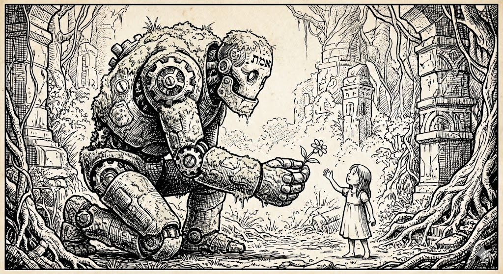

## Golem XIV & metacognition

---
## Agenda

- about Xemantic and me
- about metacognition and Golem XIV
- live demo
- questions

<small>https://xemantic.com/presentations/2025/42/</small>
---
## Keywords

- agentic AI
- context engineering
- cognitive science
- (meta)cognitive AI

---
## About Xemantic

https://xemantic.com

Independent AI lab from Berlin:

- humanistic computation
- applied philosophy
- AI education

Xemantic resides at [Prachtsaal](https://prachtsaal.berlin)

---
### Xemantic's shows

<iframe width="560" height="315" src="https://www.youtube.com/embed/Hb-P2f0cyMI?si=uDb8Uo-zzsxmzXtT" title="YouTube video player" frameborder="0" allow="accelerometer; autoplay; clipboard-write; encrypted-media; gyroscope; picture-in-picture; web-share" referrerpolicy="strict-origin-when-cross-origin" allowfullscreen></iframe>

https://www.instagram.com/xemantic.berlin

---
## About me

Kazik Pogoda, co-founder of Xemantic:

- coder, system architect, tech lead
- philosopher (cognitive science)
- computational artist

---
### Robots will steal your food

    

https://github.com/xemantic/claudine/

_Since Claudine, I am only writing code which machines still cannot write._

---
### Xemantic's open source software

https://github.com/xemantic/

---
## What is "cognition"

Cognition defines reasoning process in abstraction from the biological substrate:

- carbon (biological)
- silicon (tech)
- alien (sci-fi)

_Cognitive science is focused on defining models of mind regardless of what makes the "mind"_

---
## Is LLM a cognitive machine?

Very controversial topic:

- Apple: [The Illusion of Thinking](https://machinelearning.apple.com/research/illusion-of-thinking)
- OpenAI: next model will be AGI
- Singularity
- Teilhard de Chardin

---
## About metacognition

Metacognition: the ability of "thinking about own thinking".

Attributed to humans and many animal species.

_In popular culture called self-consciousness_

Premise: necessary for achieving "AGI"

---
## About Golem XIV

> Golem XIV is a fictional AI character from the book of Stanisław Lem (the author of Solaris). In the 1980s Lem predicted "AGI" in 2027-2029. It's the most difficult book I've ever read, written from the perspective of superintelligence lecturing humankind.

---
## Live session with Golem
### Very alpha ...

---
## Thank You!
### Stay in touch

<small>https://www.linkedin.com/in/kpogoda/</small>
